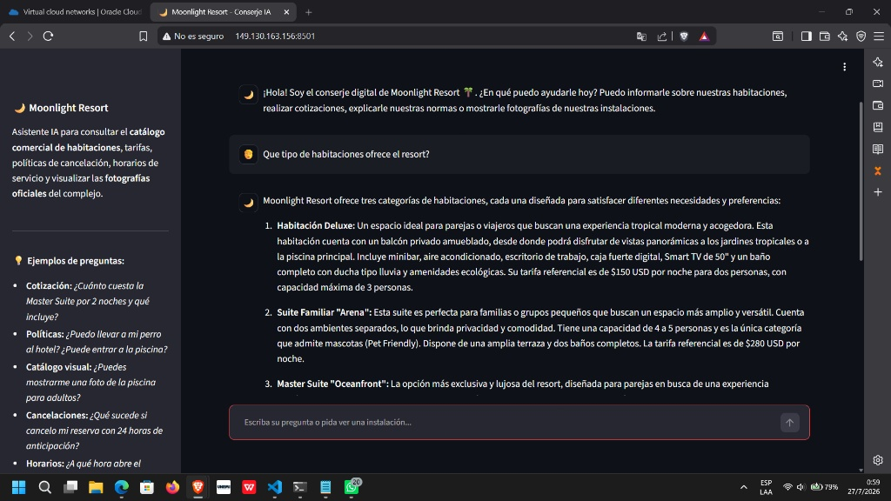
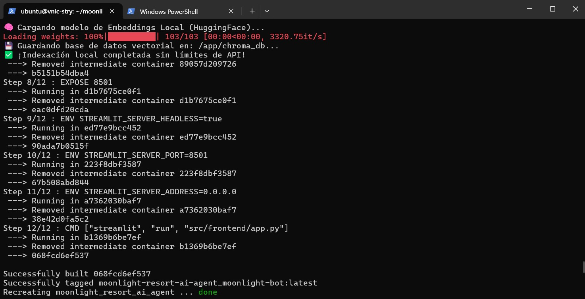

# 🌙 Moonlight Resort - Conserje IA y Asistente Virtual

Asistente de inteligencia artificial generativa y conserje digital para el complejo hotelero de lujo **Moonlight Resort**. El sistema permite a los huéspedes consultar el catálogo comercial de habitaciones, realizar cotizaciones en tiempo real, resolver dudas sobre políticas o servicios y visualizar dinámicamente las fotografías oficiales del complejo hotelero mediante un sistema de recuperación semántica (RAG).

---

## 🚀 Evidencia de Despliegue en Producción (OCI)

El proyecto se encuentra empaquetado en contenedores y desplegado en un servidor Linux dentro de **Oracle Cloud Infrastructure (OCI)**.

* **URL Pública del Agente:** [http://149.130.163.156:8501](http://149.130.163.156:8501)

### 📸 Captura de pantalla del sistema en producción:


### 💻 Captura de pantalla de la terminal (Despliegue y compilación Docker):


---

## 🏗️ Arquitectura del Sistema

La solución está construida bajo los estándares modernos de desarrollo Full Stack y las mejores prácticas de ingeniería de prompts e IA:

* **Modelo de Lenguaje (LLM):** [Cohere Command R+](https://cohere.com/) (`command-r-plus-08-2024`), un modelo empresarial altamente optimizado para tareas de RAG y uso de herramientas sin alucinaciones.
* **Orquestación:** **LangChain Expression Language (LCEL)** para cadenas de invocación limpias, modulares y asíncronas.
* **Embeddings:** **HuggingFace** (`sentence-transformers/all-MiniLM-L6-v2`) ejecutados de forma local para vectorización rápida sin costos ni límites de tasa de API.
* **Base de Datos Vectorial:** **ChromaDB** con persistencia en disco para la búsqueda semántica de documentos y manuales del resort.
* **Interfaz Gráfica y Analizador (Parser):** **Streamlit** con un motor interceptor basado en expresiones regulares (`RegEx`). Detecta etiquetas técnicas generadas por el modelo (ej. `[ID_IMAGEN: IMG_DELUXE_01]`) y las traduce en tiempo real a elementos fotográficos en la interfaz web.
* **DevOps & Cloud:** Contenerización integral con **Docker & Docker Compose** desplegado sobre una instancia de computación Ubuntu en **Oracle Cloud Infrastructure (OCI)**.

---

## 📂 Estructura del Proyecto

```text
moonlight-resort-ai-agent/
├── data/
│   ├── images/              # Banco visual fotográfico del catálogo hotelero
│   └── pdfs/                # Manuales, tarifas y políticas del resort en PDF
├── src/
│   ├── backend/
│   │   ├── document_loader.py # Script de ingesta y vectorización en ChromaDB
│   │   ├── prompts.py         # Prompts del sistema y reglas de comportamiento
│   │   └── rag_pipeline.py    # Motor RAG y conexión con Cohere (LCEL)
│   └── frontend/
│       └── app.py             # Interfaz web conversacional y renderizador visual
├── .dockerignore            # Exclusiones para optimización de imagen Docker
├── .env.example             # Plantilla de variables de entorno requeridas
├── docker-compose.yml       # Orquestador del servicio para producción
├── Dockerfile               # Configuración de compilación del contenedor
├── requirements.txt         # Dependencias del ecosistema Python
└── README.md                # Documentación del proyecto
```

---

## ⚙️ Instalación y Ejecución Local

### Prerrequisitos
* **Docker** y **Docker Compose** instalados en tu sistema (opción recomendada).
* Python 3.10+ (sólo si deseas ejecutar sin contenedores).
* Una clave API gratuita de [Cohere](https://dashboard.cohere.com/).

### 1. Configuración de Variables de Entorno
Clona el repositorio y crea un archivo privado **`.env`** en la raíz del proyecto agregando tu clave de Cohere:

```env
COHERE_API_KEY=tu_clave_secreta_de_cohere_aqui
CHROMA_DB_DIR=/app/chroma_db
```

### 2. Ejecución Rápida con Docker (Recomendada)
Para compilar la imagen, procesar los documentos PDF automáticamente y levantar el servidor web en un solo comando:

```bash
docker compose up --build -d
```
Una vez finalizado el proceso, abre tu navegador web en: **`http://localhost:8501`**

### 3. Ejecución Manual sin Docker (Modo Desarrollo)
Si prefieres correr el proyecto localmente con un entorno virtual de Python:

```bash
# 1. Crear y activar entorno virtual
python -m venv venv
source venv/bin/activate  # En Windows (PowerShell): . env\Scripts\Activate.ps1

# 2. Instalar dependencias
pip install -r requirements.txt

# 3. Ingestar documentos y crear la base de datos vectorial local
python -m src.backend.document_loader

# 4. Iniciar la interfaz conversacional
streamlit run src/frontend/app.py
```

---

## 💡 Ejemplos de Interacción

Puedes realizar preguntas naturales al conserje virtual como:
* *"¿Cuánto cuesta la Master Suite por 2 noches y qué incluye?"*
* *"¿Puedo llevar a mi mascota al hotel? ¿Cuáles son las reglas de la piscina?"*
* *"¿Puedes mostrarme una foto de la piscina para adultos?"*
* *"¿A qué hora abre el restaurante gourmet y cuál es el código de vestimenta?"*

### ☁️ Configuración de la Infraestructura Cloud (OCI)

El despliegue en producción fue aprovisionado e implementado sobre una instancia de computación de alto rendimiento en **Oracle Cloud Infrastructure (OCI)** bajo la siguiente configuración técnica:
(data/images/captura_instancia.png)

* **Proveedor Cloud:** Oracle Cloud Infrastructure (OCI) - *Cloud Free Tier*.
* **Forma de la Instancia (Shape):** `VM.Standard.A1.Flex` (Arquitectura Ampere Altra ARM64).
* **Recursos Asignados:** **4 vCPUs** y **24 GB de Memoria RAM**, proporcionando una holgura excepcional para la ejecución del motor de embeddings locales (*HuggingFace*), la base de datos vectorial (*ChromaDB*) y el servidor *Streamlit* sin riesgos de saturación de memoria.
* **Sistema Operativo:** Ubuntu Linux 22.04 LTS.
* **Configuración de Red y Firewall (Security Lists):**
(data/images/Captura_vcn.png)
  * **Tráfico de entrada (Ingress):** Regla TCP habilitada desde `0.0.0.0/0` para el puerto de servicio `8501` en modo **Stateful** (con estado) para permitir conexiones web bidireccionales continuas.
  * **Firewall del Sistema Operativo:** Apertura y persistencia de puertos internos mediante políticas de seguridad de `iptables` / `netfilter-persistent`.
* **Gestión de Contenedores:** Servicio orquestado en segundo plano mediante el daemon de Docker (`docker-compose up -d`) con volúmenes locales asignados para la persistencia del índice vectorial (`/app/chroma_db`).